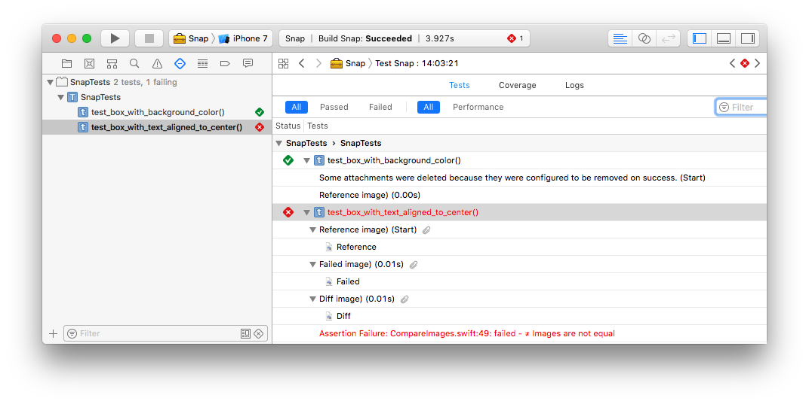
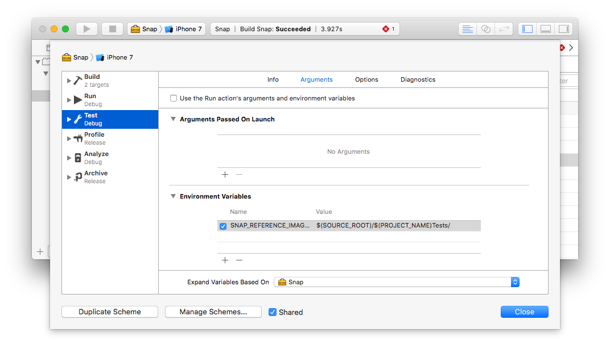

<p align="center">
  
</p>
<h1 align="center">Snap.swift - Snapshot testing in a snap 🎨</h1>
<p align="center">
    
    
    <a href="https://twitter.com/skyweb07">
        
    </a>
    <a href="https://opensource.org/licenses/MIT">
      
    </a>
</p>

`Snap.swift` is a snapshot testing library to facilitate the UI testing of your views.

### 🤖 Requirements

* iOS 9.0+
* Xcode 9.0+
* Swift / Objective-C


### 🚀 Getting started 

### 🎨 Why test the UI?
You want to make sure that every time you touch any of your UI elements everything stays as they way they were meant to be, also this kind of integration test help you achieve the pixel perfect views and make your designers happy by having design reference images that they can see even in your pull requests.

### ⚡️ How does it work?
Works by generating a reference image that gets stored in your repository and then comparing each new test case with the `reference image` to check if there are any differences. If test found any differences it will add an attachment into your test case and you'll be able to check what changed


 
### 🛠 Configuration

In order to configure the snapshot test folder, we need to add a new environment variable to the project with name `SNAP_REFERENCE_IMAGE_PATH` and value `$(SOURCE_ROOT)/$(PROJECT_NAME)Tests/` so `Snap.swift` can find the folder to store the reference images. If the configuration was correctly set the project should look like this:



> Errored images and diffed one's are stored into `$PATH/Snap/Failed` and `$PATH/Snap/Diff`, if you want you can add those paths into `.gitignore` as these are not needed for `Snap.swift` to work.

### 🎯 Installation

Snap.swift is available through [CocoaPods](http://cocoapods.org). To install
it, simply add the following line to your Podfile:

```ruby
pod 'Snap.swift'
```

### ✅ Creating our first test 

1) We first need to record our reference images, in order to do so we have to first go into our test class and set the `isRecording` variable to be `true` so the library knows that we are in record mode and can extract the `reference images`

> Swift

```swift
import XCTest
import Snap_swift

class SnapTests: XCTestCase {
  
  override func setUp() {
    super.setUp()
    isRecording = true
  }

  func test_box_with_text_aligned_to_center() {
    let view = BoxWithTextAlignedToCenterView()
    
    expect(view).toMatchSnapshot()
  }
}
```

> Objective-c
```objc
@import XCTest;
#import <Snap_swift/Snap_swift-swift.h>
#import <Snap_swift/Snap.h>

@interface SnapTests : XCTestCase
@end

@implementation SnapTests

- (void)setUp {
  [super setUp];
  self.isRecording = YES;
}

- (void)test_box_with_text_aligned_to_center {

  UIView *view = [BoxWithTextAlignedToCenterView new];
  
  verifyView(view);
}

@end

```


After executing out test suite if everything was ok we should see that all of our tests failed with a warning similar to

```bash
⚠️ Test ran in record mode, reference image has been saved to $SNAP_REFERENCE_IMAGE_PATH/testcase.png, now remove `isRecording` in order to perform the snapshot comparison.

```

This is ok, it just means that our reference images were saved, we can inspect them in our `reference image` directory, we should normally add these into `git`  so we can compare against them. 

#### ⚠️ Warning
> *Remember to remove the `isRecording` flag after generating your reference images or you won't be able to do the image comparison*

### ☑ TODO:
* [ ] Add tests for project
* [ ] Make device agnostic screenshots

### 📝 Notes

> As today, you can make assertions on `UIView` and `CALayer` classes.

This project is highly inspired on `Facebook` [FBSnapshotTestCase](https://github.com/facebookarchive/ios-snapshot-test-case/) library, it seems that they had archived the library so I started this one to continue envolving the project and continue with mobile `snapshot-testing` 

### 😬 Contributions 
- Open an [issue](https://github.com/skyweb07/Snap.swift/issues/new)
- Add suggestions or fix [issues](https://github.com/skyweb07/Snap.swift/issues) by opening PR's
- Send me a message via [Twitter](https://twitter.com/skyweb07)

### ⚖ License
```bash
MIT License

Copyright (c) 2017-Present Oscar Antonio Duran Grillo

Permission is hereby granted, free of charge, to any person obtaining a copy
of this software and associated documentation files (the "Software"), to deal
in the Software without restriction, including without limitation the rights
to use, copy, modify, merge, publish, distribute, sublicense, and/or sell
copies of the Software, and to permit persons to whom the Software is
furnished to do so, subject to the following conditions:

The above copyright notice and this permission notice shall be included in all
copies or substantial portions of the Software.

THE SOFTWARE IS PROVIDED "AS IS", WITHOUT WARRANTY OF ANY KIND, EXPRESS OR
IMPLIED, INCLUDING BUT NOT LIMITED TO THE WARRANTIES OF MERCHANTABILITY,
FITNESS FOR A PARTICULAR PURPOSE AND NONINFRINGEMENT. IN NO EVENT SHALL THE
AUTHORS OR COPYRIGHT HOLDERS BE LIABLE FOR ANY CLAIM, DAMAGES OR OTHER
LIABILITY, WHETHER IN AN ACTION OF CONTRACT, TORT OR OTHERWISE, ARISING FROM,
OUT OF OR IN CONNECTION WITH THE SOFTWARE OR THE USE OR OTHER DEALINGS IN THE
SOFTWARE.
```
